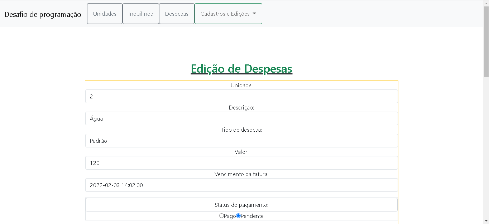

<h1>Opções do sistema:</h1>
<ul>
 <li><a href="#CadastroDeUnidades">Cadastro de unidades;</a></li>
 <li><a href="#CadastroDeInquilinos">Cadastro de inquilinos;</a></li>
 <li><a href="#CadastroDeDespesas">Cadastro de despesas;</a></li>
 <li>----</li>
 <li><a href="#EdicaoDeInquilinos">Edição de inquilinos;</a></li>
 <li><a href="#EdicaoDeUnidades">Edição de unidades;</a></li>
 <li><a href="#EdicaoDeDespesas">Edição de despesas;</a></li>
 <li>----</li>
 <li><a href="#ListagemDeUnidades">Visualização das unidades;</a></li>
 <li><a href="#ListagemDeInquilinos">Visualização dos inquilinos;</a></li>
 <li><a href="#ListagemDeDespesas">Visualização das despesas;</a></li>
 <li>----</li>
 <li>Filtro por unidade;</li>
 <li>Filtro por despesas com fatura vencida;</li>
</ul>
<h2 class="text-success text-center">Tecnologias utilizadas</h2>
<ul class="p-0">
 <li class="border ps-3">PHP</li>
 <li class="border ps-3">Javascript</li>
 <li class="border ps-3">SQL / MySQL</li>
 <li class="border ps-3">XAMPP / Apache</li>
 <li class="border ps-3">HTML</li>
 <li class="border ps-3">CSS</li>
 <li class="border ps-3">Jquery</li>
 <li class="border ps-3">Plugin jquery.mask</li>            
 <li class="border ps-3">Ajax</li>            
 <li class="border ps-3">Bootstrap</li>
 <li class="border ps-3">Arquitetura MVC</li>
 <li class="border ps-3">Composer</li>
 <li class="border ps-3">Packagist</li>            
 <li class="border ps-3">Package: coffeecode/router: 1.0.*</li>
 <li class="border ps-3">Package: league/plates: v4.0.0-alpha</li>            
</ul>	
<h2>Vamos começar</h2>
<ul>
 <li>Recomendo baixar um ambiente de desenvolvimento pronto como o XAMPP(Recomendo) ou WampServer;</li>
 <li>Clone o repositório para sua máquina;</li>
 <li>S</li>
</ul>
<h2 id="CadastroDeUnidades">Cadastro de unidades</h2>

<h2 id="CadastroDeInquilinos">Cadastro de inquilinos</h2>

<h2 id="CadastroDeDespesas">Cadastro de despesas</h2>

<h2 id="EdicaoDeInquilinos">Edição de unidades</h2>

<h2 id="EdicaoDeUnidades">Edição de inquilinos</h2>

<h2 id="EdicaoDeDespesas">Edição de despesas</h2>

<h2 id="ListagemDeUnidades">Visualização das unidades</h2>

<h2 id="ListagemDeInquilinos">Visualização dos inquilinos</h2>

<h2 id="ListagemDeDespesas">Visualização das despesas</h2>

<h2 class="text-success text-center">Tecnologias utilizadas</h2>

